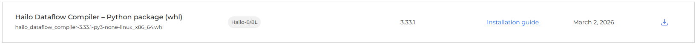
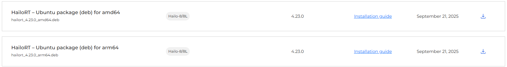

## Data Sources and Models


### Import some entries from DocLayNet-v1.2 Dataset
You do not need the entire massive dataset. In fact, downloading and using the full DocLayNet-v1.2 dataset is likely to cause more engineering headaches than it solves, especially when optimizing for edge hardware. 

The amount of data you need depends entirely on which step of the pipeline you are running. Here is the breakdown for both processes:

### 1. For INT8 Quantization (The Hailo Calibration Step)
**Requirement: Tiny (500 to 1,000 images maximum)**

When you run your `main.py` script to optimize the ONNX model into a `.hef` file, the Hailo Dataflow Compiler uses this data solely to figure out the statistical distribution of pixel values (min, max, mean). It uses this to map floating-point numbers to 8-bit integers.
* **Why less is more:** If you try to load 10,000 images into that `np.stack` function, you will instantly run out of RAM and crash your machine. 
* **The Golden Rule:** For calibration, **diversity is infinitely more important than volume.** You want 500 images that cover every possible extreme: pure text pages, pages that are 90% images, dense tables, dark lighting, skewed scans, and mathematical formulas. Adding 5,000 similar-looking pages adds zero value to the quantization math.

### 2. For Fine-Tuning the Base YOLO26 Model
**Requirement: Small to Medium (5,000 to 10,000 images)**

If you choose to fine-tune the base `yolo26n.pt` model yourself, you are utilizing transfer learning. The base YOLO model already understands fundamental visual concepts (edges, corners, contrasting colors) from being trained on millions of generic images. You are simply re-aligning its existing knowledge to recognize document-specific boundaries.
* **Targeted Sampling:** Since you are building a research archival system, you don't need the model to be an expert at parsing glossy magazine layouts or financial spreadsheets. DocLayNet contains specific categories like "Scientific Articles," "Manuals," and "Patents." You can filter the dataset to only pull a few thousand images from those highly relevant categories. 
* **Training Time:** Training on 5,000 carefully curated, high-quality images at 640x640 resolution will give you excellent precision without requiring weeks of GPU rental time.

### How to Avoid the Massive Download

Because DocLayNet-v1.2 is hosted on Hugging Face, you do not have to download the entire multi-gigabyte zip file. You can use the Hugging Face `datasets` library in Python with the `streaming=True` parameter. This allows you to inspect the dataset on the fly, filter for specific document types (like scientific papers), and download exactly the 5,000 images and YOLO-formatted text files you need directly to your local drive.

```python
from datasets import load_dataset

# Login using e.g. `huggingface-cli login` to access this dataset
ds = load_dataset("docling-project/DocLayNet-v1.2")
```

### Models

Because YOLO26 is .pt and Hailo requires .onnx, you must perform an ONNX export before you ever touch the Hailo DFC Python API.

Fortunately, Ultralytics has this exporter built directly into their library. Your code snippet was attempting to use a Hugging Face Transformers syntax (from_pretrained), which Ultralytics doesn't use for its base models.

```python
from ultralytics import YOLO

# 1. Load the YOLO26 PyTorch model
# If you downloaded it locally, just point to the file:
model = YOLO("yolo26n.pt") 

# 2. Run your test prediction
source = 'http://images.cocodataset.org/val2017/000000039769.jpg'
results = model.predict(source=source, save=True)
print("Prediction successful.")

# 3. THE INTERMEDIATE STEP: Export to ONNX for Hailo
# This converts the .pt into an .onnx file optimized for a 640x640 input
onnx_file_path = model.export(
    format="onnx", 
    imgsz=640, 
    simplify=True, # Simplifies the graph, making Hailo's job easier
    opset=11       # Hailo generally prefers ONNX opset 11 or 12
)

print(f"ONNX model ready for Hailo DFC at: {onnx_file_path}")
```

⚠️ The "NMS Trap" for Hailo Compilation
When you run that model.export() command, you need to be aware of one major architectural quirk.

By default, Ultralytics tries to be helpful and attaches a complex Non-Maximum Suppression (NMS) layer to the very end of the .onnx graph to filter out overlapping bounding boxes. The Hailo compiler hates standard PyTorch NMS nodes. It struggles to quantize them and will often throw an error during the runner.translate_onnx_model step.

When you move this resulting .onnx file into your Hailo main.py script, you will likely need to strip those final NMS output nodes using the start_node_names and end_node_names parameters in the Hailo parser, and then use a Hailo ALLS script to replace them with Hailo's hardware-accelerated NMS layer.

For your DocLayNet-v1.2 project (which has 11 document classes), your ALLS script would look something like this:

```text
# yolo_doc_layout.alls

# 1. Define the input normalization (so you don't have to divide by 255 in Python)
normalization1 = normalization([0.0, 0.0, 0.0], [255.0, 255.0, 255.0])

# 2. Tell the compiler to fuse the YOLOv8/v26 NMS architecture into the hardware
nms_postprocess(meta_arch=yolov8, engine=hailo, classes=11, confidence_threshold=0.25, iou_threshold=0.45)
```

By feeding this short script into the ClientRunner during Step 1, the Hailo compiler automatically handles all the complex YOLO math, resulting in a .hef file that runs at maximum speed on the accelerator.

## Training Considerations

### 1. The Resolution Trap (The 1280x1280 Problem)
If you look closely at the model card details for the community model, the author noted a critical detail: **"All models were trained at 1280x1280 resolution."** They did this because standard 640x640 training caused a performance drop on tiny elements like footnotes.

* **The Cloud/GPU World:** 1280x1280 is fine for a cloud server with an Nvidia GPU.
* **The Edge/Hailo World:** Pushing a 1280x1280 image tensor through a Hailo-8L on a Raspberry Pi is incredibly heavy. It consumes massive amounts of the NPU's SRAM, drastically increasing latency and bottlenecking your asynchronous Rust pipeline. 

If you take that community model and force the Hailo compiler to quantize it down to a 640x640 input to gain speed, the model's accuracy will collapse because it was explicitly trained to look for features at a much higher pixel density. 

### 2. Controlling the Anchor Boxes for Edge Constraints
By fine-tuning the base `yolo26n.pt` (nano) model yourself, you maintain control over the training resolution. You can train the model at a highly optimized edge resolution (like `imgsz=640` or `800`). 

To solve the "tiny footnote" problem without bloating the image resolution to 1280, you can adjust the YOLO hyperparameters during your custom training run:
* **Custom Anchors:** You can force the model to learn tighter anchor boxes specifically tailored for small text.
* **Tiling/Slicing:** You can train the model to look at document quadrants rather than massive full-page scans.

### 3. Quantization Synergy
INT8 Post-Training Quantization (PTQ) on the Hailo Dataflow Compiler is highly sensitive to the data distribution. When you use a community model, you don't always know the exact normalization techniques, augmentations, or color space conversions the author applied during training. 

If your Hailo calibration dataset (in your `main.py` script) is pre-processed even slightly differently than how the community model was trained, the quantization process will generate compounding mathematical errors, resulting in terrible bounding box predictions on the Pi.

Training it yourself guarantees a 1:1 match between your training data distribution and your Hailo calibration distribution.

## Hailo SDK Download Reference

These are the exact SDK download item types needed for this project:

- Hailo Dataflow Compiler - Python package (`.whl`)
- HailoRT - Ubuntu package (`.deb`) for your target architecture (`amd64` or `arm64`)

### Hailo Dataflow Compiler (Python wheel)



### HailoRT (Ubuntu deb package)



## Acknowledgements

- Ultralytics YOLO26 on Hugging Face: https://huggingface.co/Ultralytics/YOLO26/tree/main
- DocLayNet-v1.2 dataset on Hugging Face: https://huggingface.co/datasets/docling-project/DocLayNet-v1.2